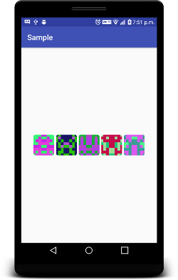

# BlockiesAndroid
Port of the Blockies library used to create identicons in Mist



## Usage

```xml
    <blockies.ethereum.luminiasoft.com.blockiesandroid.BlockiesIdenticon
        android:id="@+id/identicon"
        android:layout_width="50dp"
        android:layout_height="50dp"
        blockies:address="0xe5bdF34F4cCC483e4ca530CC7Cf2Bb18fEbE92b3"/>
```

## Donations
0x7d2306C55404c263F4d3DEBF839f862CeE22ead6
